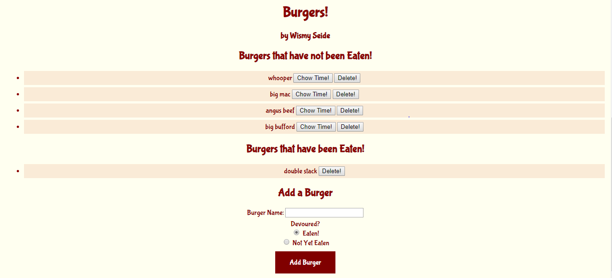

# Eat Da Burger
### by Wismy Seide
Eat Da Burger is a restaurant application that allows you to create and eat burgers at anytime you want.  You will be able to enter the name of the burger and see it added to the list.  Then you will be able to devour the burger and the burger will be devoured.

## Getting Started
Open your terminal and navigate to the burger directory and then enter: ```npm install```. This will install the node modules needed. This app will let user add a burger and choose the burger to be eaten or deleted.

The user may enter any burger name to add it to the menu. This also adds the new burger entry into the MySQL database. The initial burger entry is added as available on the menu and placed on the top side of the screen. The user may then eat any burger which moves it into the adjacent column and updates its status accordingly in the database.

## Burger Menu
Big Mac
Whooper Jr.
Double Stack
Angus Beef


